<p align="center">
  
</p>

<p align="center">
  <b>Fully automatic AI social media for <a href="https://servio-0.web.app">Servio</a>.</b><br>
  <sub>Every morning at 9:00&nbsp;AM&nbsp;IST — nobody involved, nothing to click.</sub>
</p>

<p align="center">
  
  
  
  
</p>

<p align="center">
  <a href="#quick-start"><b>Quick start</b></a> &nbsp;·&nbsp;
  <a href="docs/SETUP.md"><b>Setup guide</b></a> &nbsp;·&nbsp;
  <a href="#the-schedule--how-900-ist-daily-works"><b>Schedule</b></a> &nbsp;·&nbsp;
  <a href="#troubleshooting--the-8-most-likely-problems"><b>Troubleshooting</b></a>
</p>

---

A fully automatic social media system for **Servio** — the web development agency.
Every morning at **9:00 AM India time**, with no human involved, it:

1. picks a fresh topic (never repeating recent ones),
2. has Gemini (Google's AI) research it and write a LinkedIn post, an Instagram
   caption, a short X/Twitter version, and a bonus blog article draft,
3. checks its own work for quality and for being too similar to past posts
   (and rewrites it if the check fails),
4. attaches a branded Servio image, and
5. publishes to the **Servio LinkedIn Company Page** and the **Servio
   Instagram** through Buffer (a posting service).

There is nothing to approve and nothing to click. Once the keys are set up, it
just runs, every day.

> **A note on history:** an earlier version of this project was designed around
> a review step — every post waited in a Pull Request until a human clicked
> "Merge". On **2026-07-22 the owner decided to supersede that**: the system is
> now fully automatic. The old design is kept in `docs/ARCHITECTURE.md` only as
> background and as a fallback plan.

> This repository is completely separate from the Servio website code. It never
> touches it.

---

## The whole system in one picture

```
        every day, 09:00 IST — no human needed
 ┌──────────────────┐
 │  GitHub Actions   │  the "alarm clock" — wakes the system up daily
 └────────┬─────────┘
          ▼
 ┌──────────────────┐
 │  Gemini (AI)      │  picks a topic, researches it, writes all the text
 └────────┬─────────┘
          ▼
 ┌──────────────────┐
 │  Quality checks   │  word counts, banned phrases, "is this too similar
 │  + duplicate scan │  to a recent post?" — fails → AI rewrites, up to 3x
 └────────┬─────────┘
          ▼
 ┌──────────────────┐
 │  Branded image    │  one of 6 Servio-branded images, uploaded to a
 │  (Cloudinary)     │  public web address so Instagram can use it
 └────────┬─────────┘
          ▼
 ┌──────────────────┐      ┌─────────────────────────────┐
 │  Buffer           │ ───▶ │  LinkedIn Company Page       │
 │  (the publisher)  │ ───▶ │  Instagram (Business)        │
 └──────────────────┘      └─────────────────────────────┘
          ▼
   history saved (data/posts.json) + blog draft saved + optional
   notification to your Slack/Discord
```

---

## Quick start

You only do this once. Everything is explained click-by-click in
**[docs/SETUP.md](docs/SETUP.md)** — this is the short version:

1. **Buffer** — create a Buffer account, connect the Servio LinkedIn Company
   Page and the Servio Instagram as channels, and create an API key
   (SETUP.md, section A).
2. **Gemini** — create a Gemini API key at Google AI Studio (section B).
3. **Cloudinary (optional but recommended)** — set up free image hosting so
   Instagram posts get the branded image (section C). Without it, LinkedIn
   still posts; Instagram is skipped.
4. **Add the secrets to GitHub** — repo Settings → Secrets and variables →
   Actions (section D). The full list is in the table below.
5. **Find your two channel IDs** — run `npm run channels` on your computer and
   copy the two IDs it prints into GitHub Secrets (section A5 walks through it).
6. **Test without posting** — on GitHub, open the **Actions** tab → **Daily
   social post** → **Run workflow** → choose mode `health`. Every required
   check should say "ok" (optional ones, like Cloudinary when you skipped it,
   say "info" — that's fine).
7. **Rehearse** — run the workflow again with mode `daily` and the **dry_run**
   box ticked. The whole pipeline runs and shows you exactly what it *would*
   post, without sending anything.
8. Done. From now on it posts by itself every morning at 9:00 IST.

---

## The secrets (keys) — all of them, and where each comes from

"Secrets" are the keys the system needs, stored in GitHub's locked safe
(repo **Settings → Secrets and variables → Actions**). Names must be copied
EXACTLY — capital letters and underscores matter.

### Required — the system will not start without these four

| Name (exact) | What it powers | Where the value comes from |
|---|---|---|
| `GEMINI_API_KEY` | The AI writer | Google AI Studio → aistudio.google.com/apikey ([SETUP.md](docs/SETUP.md) section B) |
| `BUFFER_API_KEY` | The publisher (one key covers all channels) | Buffer → publish.buffer.com/settings/api (SETUP.md section A4) |
| `BUFFER_LINKEDIN_CHANNEL_ID` | Tells Buffer WHICH channel is the LinkedIn Page | Printed by `npm run channels` (SETUP.md section A5) |
| `BUFFER_INSTAGRAM_CHANNEL_ID` | Tells Buffer WHICH channel is Instagram | Printed by `npm run channels` (SETUP.md section A5) |

### Optional — nice to have

| Name (exact) | What it powers | Where the value comes from |
|---|---|---|
| `CLOUDINARY_CLOUD_NAME` | Image hosting (Instagram needs it) | Cloudinary dashboard, top of the page (SETUP.md section C) |
| `CLOUDINARY_UPLOAD_PRESET` | Image hosting (goes with the one above) | Cloudinary → Settings → Upload → an "unsigned" preset (SETUP.md section C) |
| `NOTIFY_WEBHOOK_URL` | A one-line message to your Slack or Discord after every run (success or failure) | Your Slack/Discord "incoming webhook" address — created inside Slack/Discord, both free |

If the two Cloudinary values are missing, nothing breaks: posts go out without
an image and Instagram is **skipped** (Instagram refuses image-less posts).

There are a few more optional settings (like `DRY_RUN`) that are switches, not
keys — they are all listed with plain-English explanations in
[`.env.example`](.env.example).

---

## Finding the channel IDs — `npm run channels`

Buffer identifies each connected social account (it calls them "channels") by
an ID. The system needs the two IDs so it knows where to post. There is a
built-in command that looks them up for you:

1. Set up the repository on your computer (see "Running it on your own
   computer" below — steps 1 to 4).
2. Put ONLY your `BUFFER_API_KEY` into the local `.env` file.
3. In the terminal, type `npm run channels` and press Enter.
4. It prints a small table: CHANNEL ID, NAME, SERVICE.
5. Copy the ID from the row whose service says `linkedin` into the
   `BUFFER_LINKEDIN_CHANNEL_ID` GitHub secret, and the `instagram` row's ID
   into `BUFFER_INSTAGRAM_CHANNEL_ID`.

This command only *reads* your channel list — it never posts anything.
Full click-by-click steps: [docs/SETUP.md](docs/SETUP.md), section A5.

---

## Running it on your own computer (optional)

Everything runs on GitHub automatically — you never *have* to run anything
locally. But if you want to:

1. Install Node.js (version 20 or newer) from https://nodejs.org — the "LTS"
   download, ordinary next-next-finish install.
2. Open a terminal in this folder (on Windows: right-click the folder →
   "Open in Terminal").
3. First time only: type `npm install` and press Enter (downloads the tools —
   takes a minute).
4. Make a copy of the file `.env.example` and name the copy `.env`. Open
   `.env` in Notepad and fill in the values (same values as the GitHub
   secrets). This file stays on your computer — it is ignored by git and never
   uploaded.
5. Now you can run:

| Type this | What it does |
|---|---|
| `npm run health` | Checks every connection (Gemini, Buffer, channels, Cloudinary, history) and prints a table. Posts nothing. |
| `npm run channels` | Prints your Buffer channel IDs (only needs `BUFFER_API_KEY`). Posts nothing. |
| `npm start` | The real daily run — generates AND PUBLISHES today's posts. |
| `npm run generate:week` | Generates 7 different post packs and schedules one for 9:00 IST on each of the next 7 days. |
| `npm run images` | Regenerates the 6 branded images in `assets/pool/`. |

**To rehearse without posting:** open `.env` and set `DRY_RUN=true`, then run
`npm start`. See the next section.

---

## DRY_RUN — the rehearsal switch

`DRY_RUN=true` makes the system do a full rehearsal:

- The AI writes real content, the quality checks really run — you see exactly
  what a real run would produce, in the logs.
- **Nothing is sent to Buffer.** Nothing appears on LinkedIn or Instagram.
- The image steps are skipped, and no history record is saved — so the next
  real run behaves as if the rehearsal never happened. (One harmless leftover:
  the bonus blog draft IS still written to `data/blog-drafts/`, so you can
  read what the AI produced.)

On GitHub, tick the **dry_run** box when using **Run workflow**. On your
computer, set `DRY_RUN=true` in `.env`.

---

## Manual runs from GitHub

You can trigger the system by hand any time:

1. Open the repository on github.com and click the **Actions** tab.
2. Click **Daily social post** in the left list.
3. Click the **Run workflow** button (right side).
4. Pick a **mode**:
   - `daily` — a normal run (post today's content now),
   - `health` — check all connections, post nothing,
   - `week` — generate and schedule the next 7 days at once.
5. Optionally tick **dry_run** for a rehearsal.
6. Click the green **Run workflow** button and watch it go. Every run ends
   with a small summary table right on the run's page.

---

## The schedule + the review window — how it works

The system runs the **evening before** and **schedules** the post for the next
morning, so you always get a window to look at it first:

- GitHub Actions runs the workflow on a timer (a "cron"), set to **14:30 UTC ==
  20:00 IST (8 PM)**. It generates that day's post and **schedules it in Buffer
  for 09:00 IST the next morning** (India time is always UTC+5:30, no daylight
  saving, so times never drift).
- **The review window:** from 8 PM until 9 AM the next day, the finished post
  (text **and** image) sits in your **Buffer dashboard**. Open Buffer to
  **read it, edit the words, or delete it** before it publishes. Do nothing and
  it publishes automatically at 9 AM — so it stays hands-off by default.
- **GitHub's timer is "best effort":** a run can occasionally start late. Safe
  here — the post is scheduled for a fixed time regardless of when it was made.
- **It can never double-post.** The system keeps one record per post date. If a
  post for that morning already exists, it says "already exists" and stops. Late
  timers, repeated triggers, and manual runs are all safe.
- After every run, GitHub commits the day's history and logs back to the repo —
  so `data/posts.json` and `logs/` are a complete, readable diary.

**Want instant posting with no review window instead?** Add a repo secret
`REVIEW_WINDOW` set to `false`, and change the cron back to `30 3 * * *`
(09:00 IST) in `.github/workflows/social-post.yml`.

---

## What's in each folder

```
servio-social/
├─ .github/workflows/
│  └─ social-post.yml        the daily schedule + manual-run buttons (GitHub Actions)
├─ assets/
│  ├─ logo/                  Servio logos
│  └─ pool/                  the 6 branded images posts rotate through
├─ data/
│  ├─ posts.json             the system's memory: every post ever made
│  └─ blog-drafts/           the bonus blog article drafts, one file per day
├─ docs/
│  ├─ SETUP.md               click-by-click account & key setup (for you)
│  ├─ BUILD.md               the technical build brief (for developers)
│  └─ ARCHITECTURE.md        design notes; the old V1 design kept as fallback
├─ logs/                     one plain-text log file per run (the diary)
├─ scripts/
│  └─ generate-brand-images.mjs   regenerates the assets/pool images
├─ src/                      the program itself
│  ├─ index.ts               the conductor: runs the whole daily flow
│  ├─ types.ts               shared definitions every part agrees on
│  ├─ config/env.ts          reads and double-checks all settings/keys
│  ├─ ai/                    everything that talks to Gemini (topics, writing)
│  ├─ buffer/                everything that talks to Buffer and Cloudinary
│  └─ services/              helpers: logging, retries, quality checks, history
├─ .env.example              every setting explained (copy to .env for local runs)
└─ package.json              the `npm run ...` commands and the tool list
```

---

## How publishing works

The system never talks to LinkedIn or Instagram directly. It hands each
finished post to **Buffer**, a well-established posting service, and Buffer
does the platform-specific work. One Buffer key covers every connected
channel.

Two publishing styles are used:

- **Daily run:** the post is added to Buffer's queue for immediate publishing
  ("post this now").
- **Week run (`--week` / mode `week`):** each of the 7 posts is scheduled for
  an exact moment — 9:00 AM IST on its day — and Buffer holds them and
  releases them on time.

LinkedIn is published first, then (2 seconds later) Instagram. The two are
independent on purpose: if one fails, the other still goes out.

---

## The image pipeline

1. **The pool:** `assets/pool/` holds 6 abstract Servio-branded images
   (blue-and-white, no text). Each day one is picked based on the date, so the
   look rotates automatically. (`npm run images` regenerates them.)
2. **Hosting:** Buffer only accepts images that live at a public web address —
   it cannot take a file directly. So the chosen image is uploaded to
   **Cloudinary** (a free image-hosting service), which returns a public
   address.
3. **Attaching:** that address is attached to both posts, with alt text (the
   image description used by screen readers).

If Cloudinary isn't set up, or the upload fails even after retries: LinkedIn
posts **without** an image, and Instagram is **skipped** for the day (marked
"skipped", not "failed") — because Instagram does not allow posts without an
image.

---

## How it avoids repeating itself

Three layers stop the account from sounding like a broken record:

1. **Topic rotation.** There is a pool of 18 topics (AI, Web Development,
   SEO, Startups, ...). The system always picks the one used longest ago and
   never picks anything used in the last 10 posts. Then the AI finds a fresh
   *angle* on that topic, and it is shown the angles already used so it avoids
   them.
2. **Similarity scan.** Every new draft is compared, word-pattern by
   word-pattern, against the last 30 posts in the history (the technique is
   called a Dice similarity score — 0 means totally different, 1 means
   identical). Too similar to any of them — or the LinkedIn and Instagram
   versions too similar to *each other* — and the draft is rejected.
3. **Rewrite with feedback.** A rejected draft isn't just retried blindly —
   the exact reasons ("too similar to the post from July 3rd", "too many
   emojis") are handed back to the AI, which rewrites. Up to 3 rewrites; if
   every attempt fails, the run stops and reports a failure rather than
   posting something repetitive.

The memory behind all this is `data/posts.json` — every post ever made, with
its text, topic, angle, and status. That same memory is what makes double
posting impossible (one record per day, checked before anything runs).

---

## What happens when something goes wrong

The system is built to degrade gracefully — one broken piece never brings down
the rest:

| If this fails... | ...then this happens |
|---|---|
| The AI research step | The writer just works without research notes. Run continues. |
| The AI writing step | Automatically retried up to 3 times (with growing pauses). Run fails only if all attempts fail. |
| The quality/duplicate check rejects the draft | Rewritten with feedback, up to 3 times. Then the run fails — it never posts bad content. |
| The topic-angle AI call | A sensible standard angle is used instead. Run continues. |
| Image upload (Cloudinary) | Posts go out without an image; Instagram is skipped (not failed). |
| Publishing to LinkedIn | Retried 3 times. A final failure is recorded — but Instagram still runs. |
| Publishing to Instagram | Same — independent of LinkedIn. |
| The Slack/Discord notification | Just a warning in the log. Never affects the run. |
| The Buffer channel check at startup | Warning only — the publish step reports the real error if there is one. |
| **Both** platforms fail | The run is marked failed (red X in Actions), and the webhook message says FAILED. |

The rule of thumb: **the run only counts as failed when nothing at all was
published.** A skipped Instagram is not a failure.

---

## Troubleshooting — the 8 most likely problems

**1. Instagram says "skipped — no hosted image".**
Cloudinary is not set up (or the upload failed). LinkedIn still posted.
Fix: add the two Cloudinary secrets — [docs/SETUP.md](docs/SETUP.md)
section C. Then Instagram resumes from the next run.

**2. A publish failed with a Buffer error message ("MutationError: ...").**
Buffer accepted the request but refused the post — most often because a
channel got disconnected (social networks occasionally force a re-login).
Fix: open buffer.com → Channels; if a channel shows a warning, click
reconnect. Then run the workflow manually with mode `health` to confirm.

**3. Gemini error mentioning 429, "quota", or "rate limit".**
The free daily allowance of AI requests ran out (or too many requests too
fast). The system already retried 3 times with pauses. Usually resolves by
itself — the next day's run will work. If it happens often, check usage at
aistudio.google.com.

**4. The run failed with "Content failed validation after N attempts".**
The AI could not produce a draft that passed the quality checks — the log
lists the exact reasons for every attempt. Usually a one-off; the next run
picks a different topic. If it keeps happening, whoever maintains the system
can adjust `SIMILARITY_THRESHOLD` or `MAX_REGEN_ATTEMPTS` (see `.env.example`).

**5. A warning says a channel ID was "not found" or "the ids may be swapped".**
The channel IDs in GitHub Secrets don't match the Buffer account — usually
because a channel was disconnected and reconnected (that gives it a NEW id),
or the two IDs were pasted into the wrong secrets.
Fix: run `npm run channels` again and update the two secrets.

**6. The run stopped immediately with "Configuration is invalid".**
A required secret is missing or its name is misspelled. The message lists
which ones. Fix: repo Settings → Secrets and variables → Actions — compare
names letter-for-letter with the table above.

**7. The post didn't go out at exactly 9:00.**
Normal. GitHub's timer is best-effort and can start a few minutes late on
busy days. The post still goes out. If exact timing ever matters more, the
`week` mode schedules posts inside Buffer, which releases them on the dot.

**8. A manual run says "Already posted on <date> — nothing to do".**
The safety guard: there is already a history record for today (the morning
run happened, or a week run scheduled this day). This is the double-post
protection working. To genuinely repost a day, a maintainer would remove that
day's entry from `data/posts.json` first.

For anything else: open the **Actions** tab, click the failed run, and read
the log — every step explains what it was doing in plain sentences. The same
text is saved under `logs/`.

---

## Future improvements (not built yet)

- **X (Twitter) and Facebook** — the short X version of every post is already
  written and saved daily. Publishing it is: connect the channel in Buffer,
  add its channel ID, small code addition.
- **AI-generated images** — the system already writes an image *description*
  for every post and the image code has a plug-in point for a generator; the
  pool images are the current stand-in.
- **The blog drafts** — one draft article per day accumulates in
  `data/blog-drafts/`. They could be reviewed and published on the Servio
  website.
- **Analytics** — reading engagement numbers back from Buffer to learn which
  topics perform and pick topics accordingly.

---

## More documentation

- **[docs/SETUP.md](docs/SETUP.md)** — click-by-click setup of every account
  and key. Start here.
- **[docs/BUILD.md](docs/BUILD.md)** — the technical build brief: file layout,
  external API contracts, rules. For developers.
- **[docs/ARCHITECTURE.md](docs/ARCHITECTURE.md)** — design notes. The top
  section describes the current (V2, fully automatic) system; the rest is the
  old review-mode design, kept as background and as the documented fallback.
